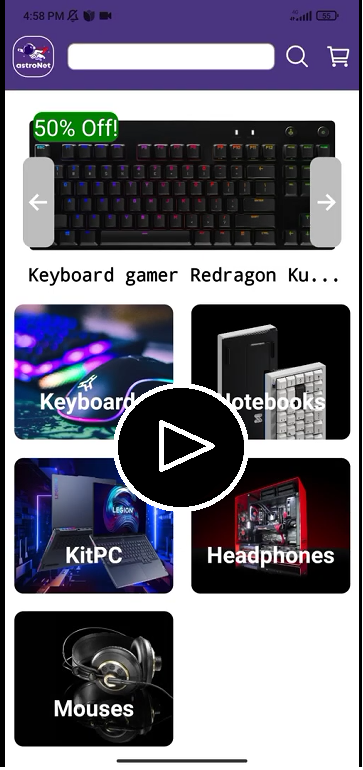

# :rocket: AstroNet
<h2>
:iphone:App mobile: E-commerce de productos tecnológicos.
</h2>

Con un equipo de 8 integrantes, desarrollamos una app en React Native con estilos en CSS que incluía base de datos en MongoDB, back en NodeJS con Express, Login con Google, bcrypt y jsonwebtoken, notificaciones push y vía email, guardado de imágenes en base de datos online con Cloudinary y pasarela de pagos con Mercado Pago.

 
<h2>
:movie_camera: Video del proyecto :
</h2>

  <a href="https://www.youtube.com/watch?v=o2CoBTuhhA4" target="_blank">  

